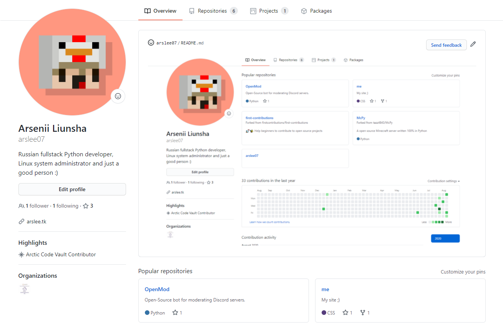

## 👋 **Hello, my name is [Arsenii](https://github.com/arslee07).**
### 😊 And you are on the main page of my Github profile.
---
### 💻 **Basically, I'm fond of Python (and not only) and sometimes do different things, for example:**
- 🛠 [OpenMod](https://github.com/OpenMod) is an open source Discord bot for moderating servers written on Python;
- ...ok, there is nothing else here, but in the future I will upload more projects here :D
---
### **Learned languages and tools:**

---
 

  
  

